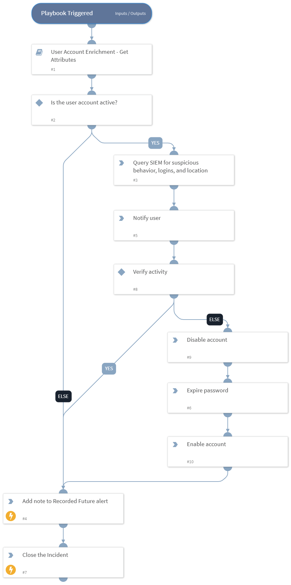

Template playbook showing suggested steps to triage leaked credential alerts. Classifier/Mapper are available to ingest Recorded Future Leaked Credential Alerts.

## Dependencies
This playbook uses the following sub-playbooks, integrations, and scripts.

### Sub-playbooks
* Account Enrichment - Generic v2.1

### Integrations
* Recorded Future v2

### Scripts
This playbook does not use any scripts.

### Commands
* closeInvestigation
* recordedfuture-alert-set-note

## Playbook Inputs
---
There are no inputs for this playbook.

## Playbook Outputs
---
There are no outputs for this playbook.

## Playbook Image
---

